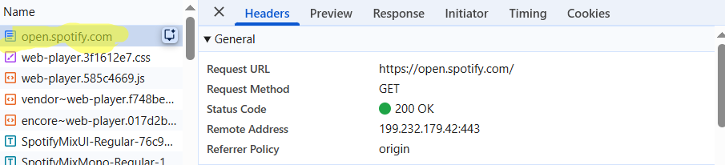
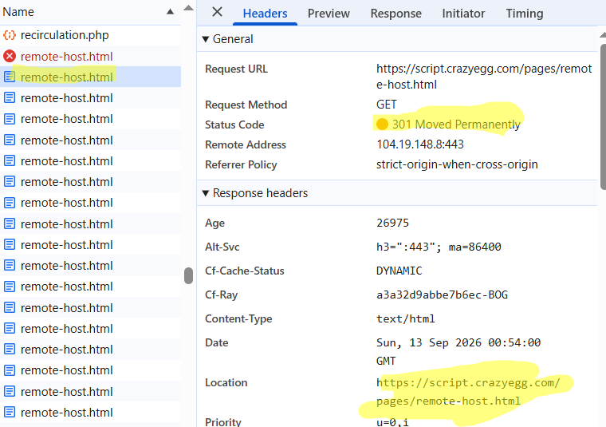
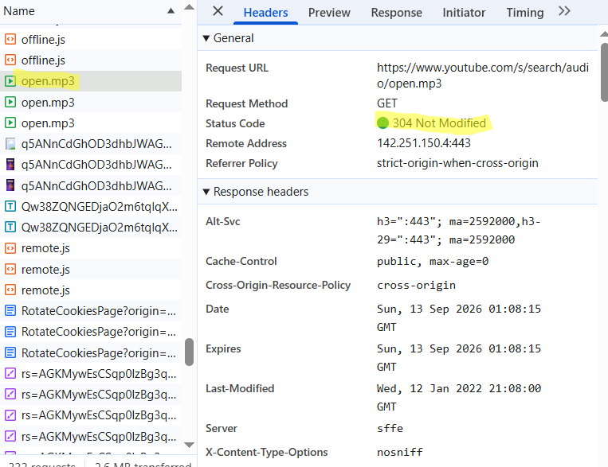
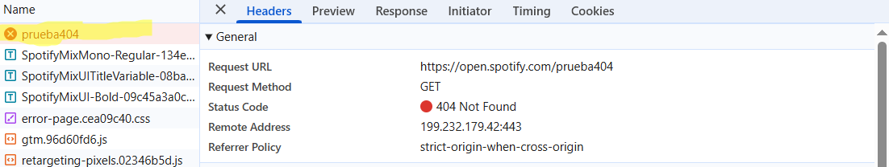

# E3 Cacería de códigos HTTP

**Fecha:** 12 sep 2026
**Herramienta:** Devtools (Chrome)

## 200 OK
**URL:** https://open.spotify.com/

Petición correcta a la pagina principal de spotify.

Quién falla: Nadie.

## 301 Moved Permanently

**URL:** http://script.crazyegg.com/pages/remote-host.html
**Location:** https://script.crazyegg.com/pages/remote-host.html

Petición redirigue a la actual existente.

Quién falla: Nadie.

## 304 Not Modified

**URL:** https://www.youtube.com/s/search/audio/open.mp3
**Headers relevantes:** `Cache-Control: max-age=0` · `Last-Modified: 12 ene 2022`

Petición de archivo que pese a ser antiguo sigue sirviendo. el mp3 no se transfirió y el navegador usó su copia local.

Quién falla: Nadie.

## 404 Not Found

**URL:** https://open.spotify.com/prueba404

Petición respondiendo 404 pero enviando a una pagina lo que significa que sí hay respuesta pero el recurso solicitado no exites.

Quien falla: Cliente, enlace inexistente.